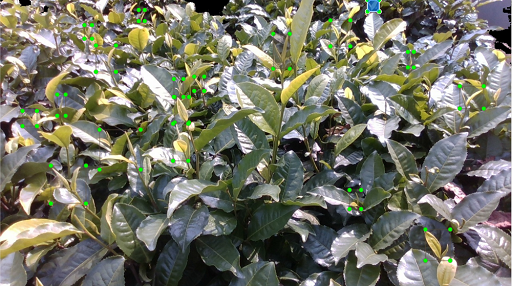
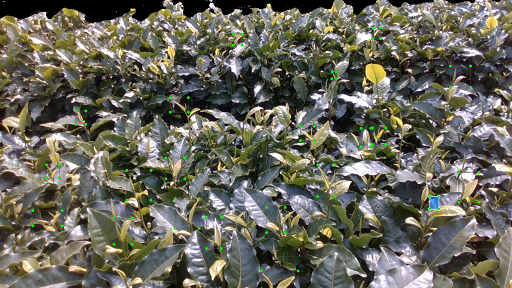

## Introduction
A tea-dataset is released to promote the development of the tea-harvesting robot. It contains 956 RGB images captured by a RealSense D435i camera, and is created in the VOC2012 format. 

## Download
The tea-dataset can be download here.

## Examples
Some visual exmaples are given below.

